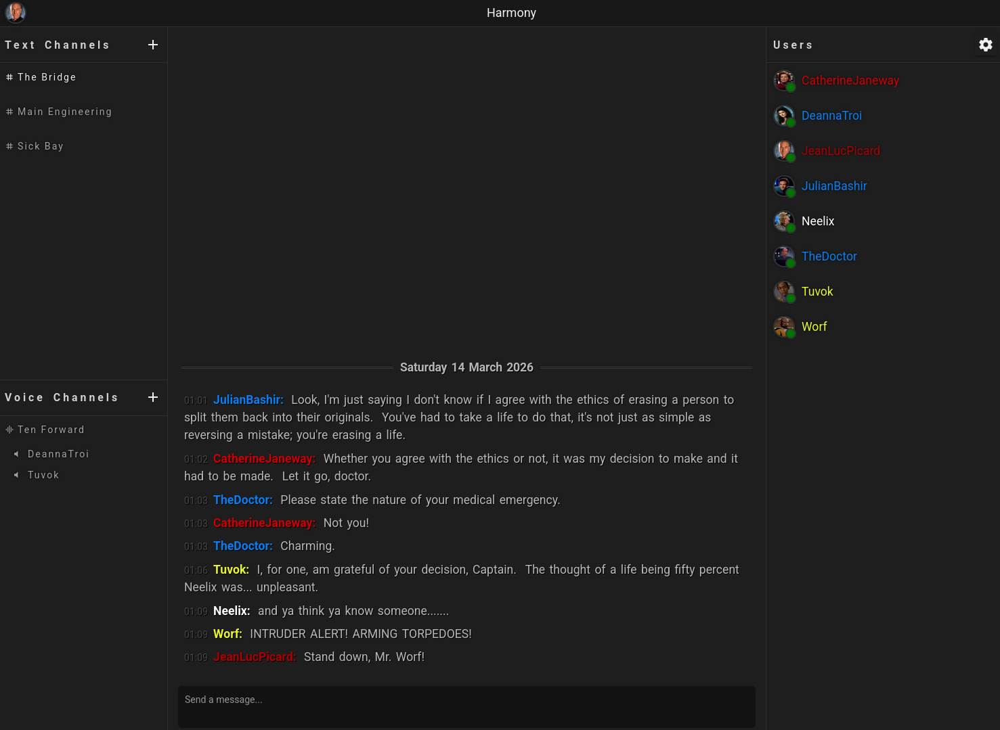
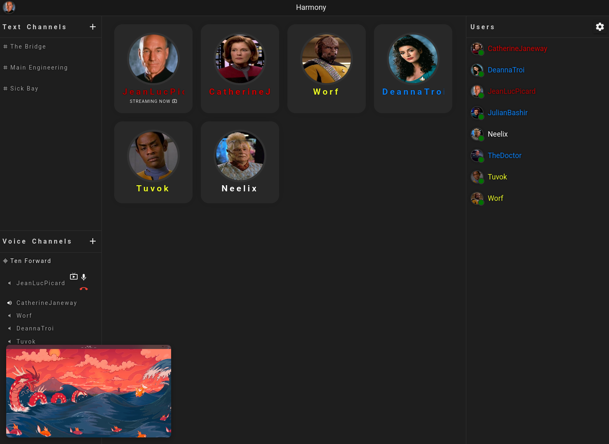
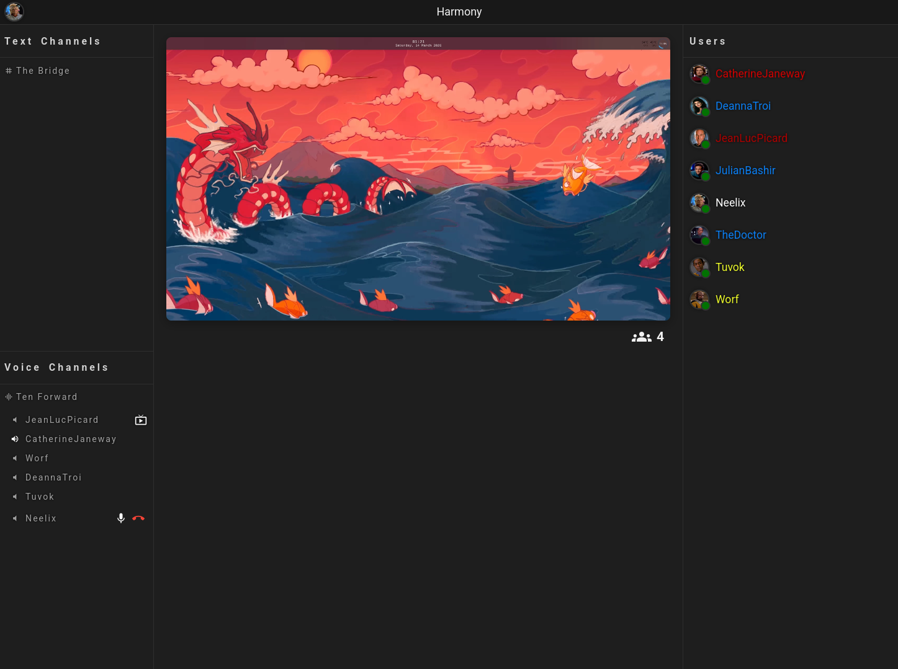

<p align="center">
  
</p>
 
<h1 align="center">Harmony Messenger - Backend API</h1>
 
<p align="center">
  A self-hosted, open-source messaging platform with text, voice, and screen sharing.
</p>
 
<p align="center">
  <a href="https://github.com/Harmony-Messenger/Harmony-Backend/blob/main/LICENSE">
    
  </a>
  
  
</p>

<p align="center">
  <strong>This is the backend API component.  You will need a frontend component such as:  <a href="https://github.com/Harmony-Messenger/Harmony-Frontend">https://github.com/Harmony-Messenger/Harmony-Frontend</a></strong>
</p>
 
---
 
## 📸 Screenshots
 
| Text Channels | Voice Channels | Screen Share |
|:---:|:---:|:---:|
|  |  |  |
 
---
 
## ✨ Features
 
- 💬 **Text Channels** — Organised, real-time messaging with role-based access control
- 🎙️ **Voice Channels** — Low-latency audio
- 🖥️ **Screen Sharing** — Live screen broadcast with VP8/VP9 video streaming
- 👥 **User Management** — Ban, activate, and reset passwords for users
- 🔐 **Role & Permission System** — Granular per-channel and global permissions
- 📨 **Direct Messages** — End to end encrypted direct messages
- 🌐 **Fully Self-Hosted** — You own your data, your server, your community
 
---
 
## 🚀 Installation
 
### Prerequisites
 
- PHP 8.1+ with gd support
- MySQL / MariaDB
- Node.js 18+
- A web server (Nginx or Apache)
 

### 1. Clone the repository
 
```bash
git clone https://github.com/Harmony-Messenger/Harmony-Backend.git
cd Harmony-Backend
```

### 2. Set up directory structure and copy files if necessary
 
```bash
mkdir /var/www/backend
cp -r * /var/www/backend
```

### 3. Set permissions (note, http:http may not be the user your web server runs as, change as appropriate)
 
```bash
chown -R http:http /var/www/backend
chmod -R 774 /var/www/backend
```

### 4. Configure your web server

Providing instructions for general setup of your webserver is beyond the scope of these instructions.

Generally you need PHP with the gd extension enabled and you need to point all requests to the backend API at /public_html/index.php.  Only this directory should be exposed by your webserver.

The config that works for me with the API exposed at https://yourservername/api:
 
```nginx
server {
  listen       443 ssl;
  server_name  yourservername;

  http2 on;
	client_max_body_size 32M;	
	
	ssl_certificate /etc/nginx/ssl/cert.pem;
	ssl_certificate_key /etc/nginx/ssl/key.pem;

	ssl_protocols TLSv1.3;
	ssl_ciphers HIGH:!aNULL:!MD5;

	root /var/www/backend/public_html;

	access_log /var/log/nginx/access.log;

  location /api {
    root /var/www/backend/public_html;
    index index.php;
    try_files $uri $uri/ /index.php$is_args$args;
  }

	location ~ \.php$ {
        	# default fastcgi_params
	        include fastcgi_params;

        	# fastcgi settings
	        fastcgi_pass			unix:/run/php-fpm/php-fpm.sock;
        	fastcgi_index			index.php;
	        fastcgi_buffers			8 16k;
        	fastcgi_buffer_size		32k;

	        # fastcgi params
        	fastcgi_param DOCUMENT_ROOT	$realpath_root;
	        fastcgi_param SCRIPT_FILENAME	$realpath_root$fastcgi_script_name;
        	#fastcgi_param PHP_ADMIN_VALUE	"open_basedir=$base/:/usr/lib/php/:/tmp/";
    	}
    }
```
 
### 4. Create a new database and user. Example:
```sql
CREATE DATABASE harmony;
CREATE USER 'harmony_user'@'localhost' IDENTIFIED BY 'strongpassword';
GRANT ALL PRIVILEGES ON harmony.* TO 'harmony_user'@'localhost';
FLUSH PRIVILEGES;
```

### 5. Configure the backend

 Visit https://yourserver/setup in a browser to run through the initial setup.

### 6. IMPORTANT: Once setup completes, ensure that it has removed the <strong>Setup</strong> directory and <strong>config.temp.ini</strong> from the root web directory.  If these aren't successfully removed after setup then the API will continuously redirect back to the initial setup or not work at all.
 

 
> ✅ The backend API should now be running at your configured domain.  Head over to <a href="https://github.com/Harmony-Messenger/Harmony-Frontend">https://github.com/Harmony-Messenger/Harmony-Frontend</a> in order to get the frontend if you haven't already.
 
---
 
## 🤝 Contributing
 
Contributions, bug reports, and feature requests are welcome! Please open an issue or submit a pull request.
 
---
 
## 📄 License
 
Harmony Messenger is licensed under the **[GNU Affero General Public License v3.0](LICENSE)**.
 
This means if you modify and run this software as a network service, you must make your modified source code available to your users.
